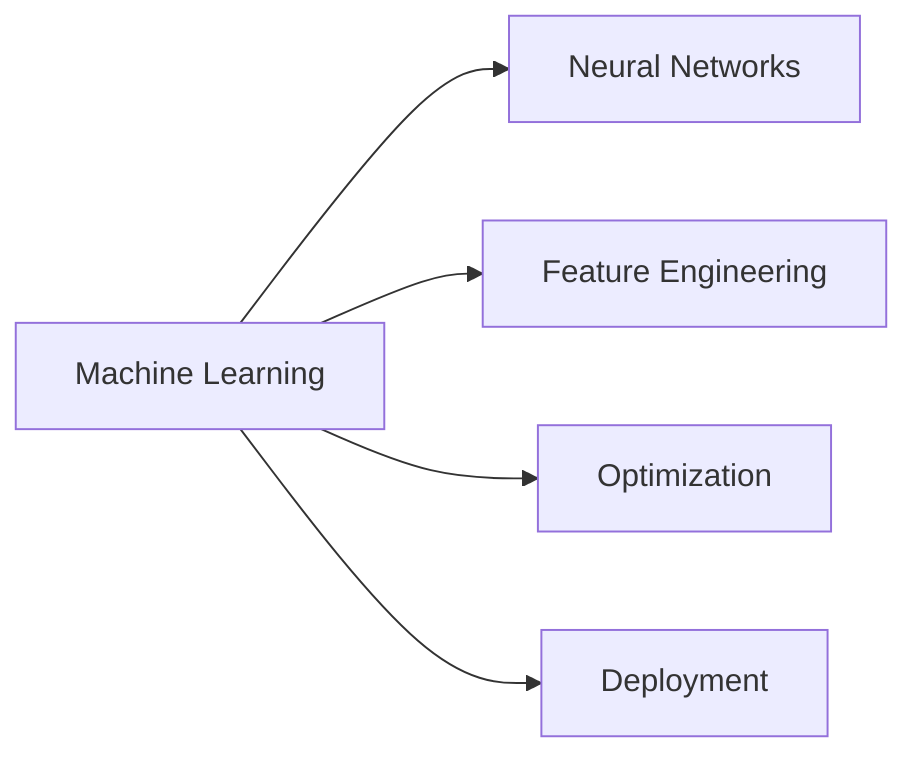

  

  

---

## 👋 About

Focused on machine learning and AI systems.  
Building projects, improving fundamentals, and working toward production-ready models.

---

## 🚀 Projects

  
  
  
  

---

## 🧠 Focus Areas

---

## 📊 Skill Overview

  
  
  
  

---

## 🛠 Tech Stack

  

---

## 📈 GitHub

  

  

  

---

  

